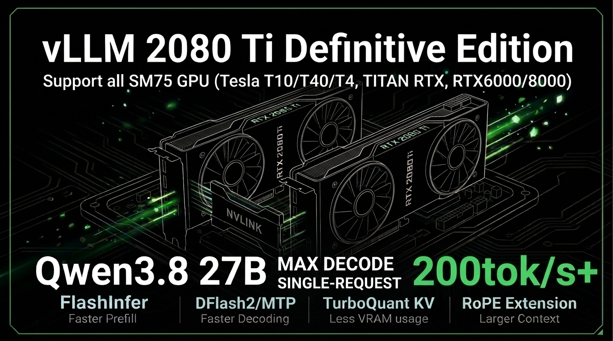
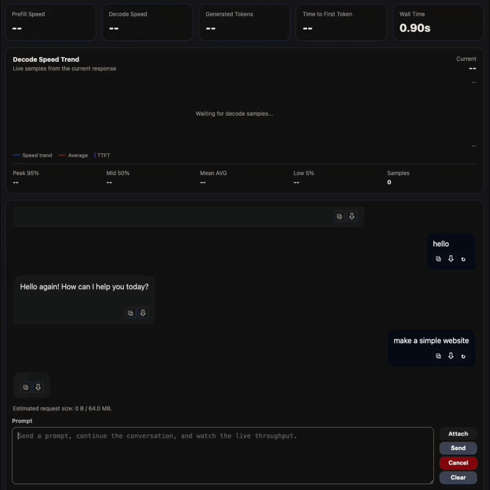
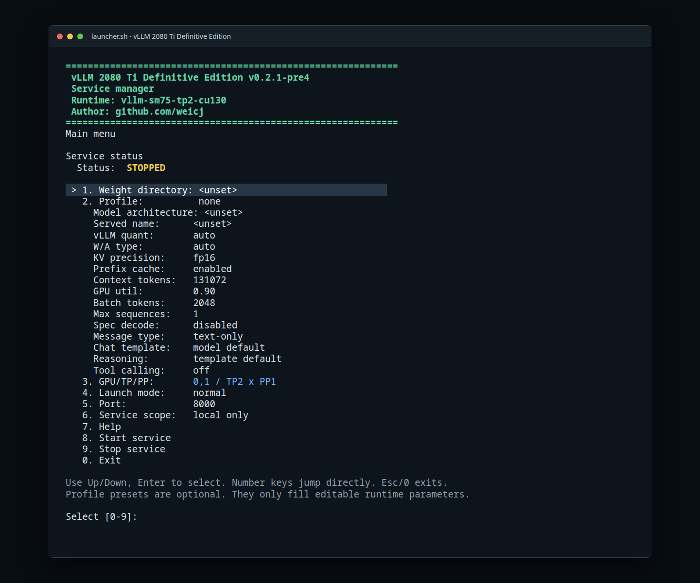

<!-- markdownlint-disable MD001 MD041 -->
# ⚡ vLLM 2080 Ti Definitive Edition



语言：[English](README.md) | 简体中文

面向双 RTX 2080 Ti 及其他 SM75 GPU 的 vLLM 专用推理运行时，包括 Tesla
T10/T40/T4、TITAN RTX 和 Quadro RTX 6000/8000。

这个硬件定向 fork 保留了复现上述 Turing 推理栈所需的 SM75 专用源码修改、launcher
profile 和验证资料。它基于上游 vLLM；再发布派生版本时必须保留上游许可证、上游署名以及
`github.com/weicj` 的项目署名。

欢迎在 [Discord 交流群](https://discord.gg/VFqVVySdMS) 分享使用体验、提出功能请求，
以及交流部署和运行问题。



当前 0.2.x 基线：`v0.2.1-pre4`
上游基线：`b23433088b`（`v0.29.1rc0-33`）

分支：[`vllm-2080ti-definitive-0.2.x`](https://github.com/weicj/vLLM-2080Ti-Definitive/tree/vllm-2080ti-definitive-0.2.x)
版本参考：[v0.2.1-pre4](https://github.com/weicj/vLLM-2080Ti-Definitive/releases/tag/v0.2.1-pre4)
版本记录：[CHANGELOG.md](CHANGELOG.md)

## 💡 为什么用 RTX 2080 Ti 做 LLM 推理？

这个项目的判断很实际：两张通过 NVLink 连接的 22 GB RTX 2080 Ti 提供 44 GB
显存、较高的显存带宽和 136 个 Turing SM。经过针对 SM75 的 vLLM 适配后，这套
硬件不只是运行小模型，也足以承载严肃的本地 27B 与 35B 级模型服务。

| 指标 | 2x RTX 2080 Ti 22 GB + NVLink | RTX 3090 Ti 24 GB 基线 | 倍率 |
| --- | ---: | ---: | ---: |
| 专用 FP32 datapath | 8,704 | 5,376 | 1.62x |
| SM 数量 | 136 | 84 | 1.62x |
| Tensor Core | 1,088 | 336 | 3.24x |
| Dense FP16 矩阵吞吐 | 228 TFLOPS | 160 TFLOPS | 1.43x |
| 总显存带宽 | 1,232 GB/s | 1,008 GB/s | 1.22x |
| 总显存 | 44 GB | 24 GB | 1.83x |

本 fork 通过 Marlin、FlashInfer/FlashQLA、TurboQuant/INT8 KV、MTP/DFlash2 和 CUDA
Graph，把这些硬件资源转成可用的 serving 栈。

第二类主要目标硬件是四张通过 PCIe 连接的 16 GiB Tesla T10，面向 TP=4 的
Qwen 27B 服务，包含 256K 上下文的文本和图文路线，并使用 ABI 匹配的 PCIe
custom all-reduce 扩展。

## 🧩 支持状态

当前目标环境是 Ubuntu 26.04 及以上、Linux kernel 7 及以上、GCC/G++ 15、CUDA 13.0 与 PyTorch 2.13。如果使用 CUDA 12.8、PyTorch 2.11、较早 kernel 或 GCC 12/13/14，可参考已不再持续维护的 `0.1.x` 版本线。

支持的模型路线和实测数据以对应硬件组的 profile 说明为准。

Launcher 支持 TP、PP 及 TP/PP 混合推理；当前主要布局为双 RTX 2080 Ti（TP=2）和四张 Tesla T10（TP=4）。

## 🧪 已验证模型路线

当前实测模型和权重路线：

| 模型路线 | 权重路线 | 模型卡 | 推荐场景 | Profile 路径 |
| --- | --- | --- | --- | --- |
| Qwen3.8 27B | FP8 | [Qwen/Qwen3.8-27B-FP8](https://huggingface.co/Qwen/Qwen3.8-27B-FP8) | 高精度单并发 | `qwen27b/w8a16` |
| Qwen3.8 27B | NVFP4 | [unsloth/Qwen3.8-27B-NVFP4](https://huggingface.co/unsloth/Qwen3.8-27B-NVFP4) | 长上下文多并发 | `qwen27b/w4a16` |
| Qwen3.x 35B | FP8 | [Qwen/Qwen3.6-35B-A3B-FP8](https://huggingface.co/Qwen/Qwen3.6-35B-A3B-FP8) | 个人快速推理 | `qwen35b/w8a16` |

## ⚡ 性能亮点

| 硬件 | 权重 | 上下文 / KV | 4K/128 prefill / decode | 32K/512 prefill / decode |
| --- | --- | --- | ---: | ---: |
| 2x RTX 2080 Ti | Qwen3.8 27B NVFP4 | 256K / FP16 | **1465.02 / 220.69 tok/s** | **1280.57 / 213.66 tok/s** |
| 4x Tesla T10 | Qwen3.8 27B FP8 | 256K / FP16 | **1444.73 / 190.78 tok/s** | **1456.77 / 188.94 tok/s** |

两组均为单请求测试，使用 DFlash2（默认 K=7）和高投机命中率合成输入。真实任务吞吐会受到 draft 接受率影响，可能无法达到以上数据。

## 🚀 构建与启动

```bash
git clone https://github.com/weicj/vLLM-2080Ti-Definitive.git
cd vLLM-2080Ti-Definitive
./build.sh
```

运行 `./launcher.sh` 即可通过交互菜单配置和管理服务：选择模型权重与 Profile、
设置 GPU 和 TP/PP 拓扑、选择启动模式与网络配置，并在启动时自动完成健康检查和
smoke 测试；也可以在菜单中停止已启动的服务。



自动化部署可使用非交互参数：

```bash
MODEL_DIR=/path/to/checkpoint \
PROFILE=2x2080Ti/qwen27b/w8a16/normal/mtp-fp8kv-1x256k-text-only.env \
MODE=normal GPU_DEVICES=4,5 TP_SIZE=2 \
NON_INTERACTIVE=1 ./launcher.sh
```

使用 `./launcher.sh --print-config` 预览路线。可用 profile 见
[2x2080Ti](profiles/2x2080Ti/README.zh-CN.md) 和
[4xT10](profiles/4xT10/README.zh-CN.md)；自动化部署见
[非交互启动说明](docs/non-interactive-launch.zh-CN.md)。

## 🧭 Profile 与推荐路线

Profile 按 `profiles/<硬件>/<模型>/<权重>/<模式>/<路线>.env` 组织，例如
`2x2080Ti/qwen27b/w8a16/normal/mtp-fp8kv-1x256k-text-only.env`、
`2x2080Ti/qwen35b/w8a16/normal/nomtp-fp16kv-1x256k-text-only.env` 和
`4xT10/qwen27b/w8a16/normal/mtp-fp16kv-1x256k-text-image.env`。

可用模式：

- `normal`：稳定的日常部署模式。
- `fast`：更高性能模式，只用于已验证路线。
- `aggressive`：性能最高但质量风险也最高。
- `safe`：用于排障和兼容性的保守回退模式。

Profile 只选择路线参数。GPU、端口、模型路径、chat template 和 reasoning 默认值
由 launcher 统一管理。

## 🛠️ 目标硬件

- 两张经 NVLink 连接的 RTX 2080 Ti 22 GB
- NVIDIA Turing / SM75，tensor parallel size 2
- `0.2.x` 目标：CUDA 13.0、PyTorch 2.13、Python 3.12
- 目标主机：Ubuntu 26.04 及以上、Linux kernel 7 及以上、GCC/G++ 15

其它 Turing 显卡仍需针对显存容量、PCIe/NVLink 拓扑、模型 head dimension、
KV cache dtype 和 CUDA Graph 行为独立验证。

## ❓ 硬件 Q&A

**需要什么样的卡间互联？**

推荐 NVLink。PCIe P2P 是底线，但没有 NVLink 时不能把窄 PCIe 链路直接视为已验证
替代方案；应先确认 P2P，再按实际主机拓扑测试。

**需要很强的 CPU 或很多内存吗？**

不需要高端 CPU，但现代单核性能和较低的平台延迟很重要。更多内存主要帮助构建、
下载和 compile cache；即使 GPU 相同，老旧 CPU 平台也可能降低 decode 吞吐。

**可以混用 11 GB 和 22 GB Turing 卡吗？**

不建议用于文档中的 27B/35B TP=2 路线。TP 会受到较小 rank 显存的限制。更好的
候选是成对的高显存 TU102 卡，例如 TITAN RTX、Quadro RTX 6000 或 Quadro RTX
8000，并且要有 NVLink 或确认可用的 PCIe P2P，之后仍需独立验证 profile。

**应该使用哪些 CUDA 和 PyTorch 版本？**

`0.2.x` 目标是 CUDA 13.0 + PyTorch 2.13。使用旧的 CUDA 12.8 + PyTorch 2.11
时，可参考已停止维护的 `v0.1.x` 兼容路线。PyTorch CUDA 构建、toolkit、FlashInfer/
FlashQLA 构建和启动 profile 必须保持一致，不能混用运行时假设。

**还有哪些硬件风险？**

注意散热、供电稳定性，以及模型和编译缓存所需的 SSD 空间。长 prefill 或反复
CUDA Graph/AOT 编译时降频很容易被误判为软件性能回退。

## 🔗 相关项目

- [2080Ti-LLM-Toolbox](https://github.com/weicj/2080Ti-LLM-Toolbox)：双 2080 Ti
  模型路线、benchmark 汇总、模型记录和运行建议的配套工具箱。本仓库聚焦于补丁后
  的 vLLM runtime。

## 🙏 致谢 / 上游项目

本仓库是基于上游 [vLLM](https://github.com/vllm-project/vllm) 的硬件定向 fork，
遵循 Apache-2.0 license，保留上游项目结构，并加入面向双 2080 Ti 的 SM75 runtime
补丁和启动 profile。

当前使用或集成的加速组件包括：

- [vLLM](https://github.com/vllm-project/vllm)：基础推理引擎和 serving 框架。
- [FlashInfer](https://github.com/flashinfer-ai/flashinfer)：attention、sampling
  和量化 kernel 路线。
- [QwenLM/FlashQLA](https://github.com/QwenLM/FlashQLA)：上游 Gated DeltaNet /
  Qwen hybrid linear-attention 实现。
- [weicj/FlashQLA-SM70-SM75](https://github.com/weicj/FlashQLA-SM70-SM75)：
  SM70/SM75 适配版本，用于已验证的 Qwen prefill 路线。
- TurboQuant、Marlin、CUTLASS、Triton 以及 vLLM 相关 kernel。

上游更新合入后，仍会在本 fork 的 SM75 范围内重新验证。
